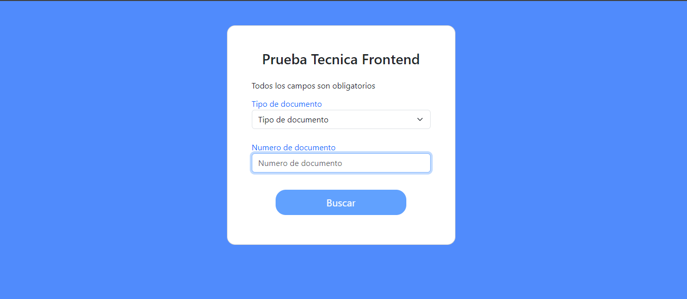
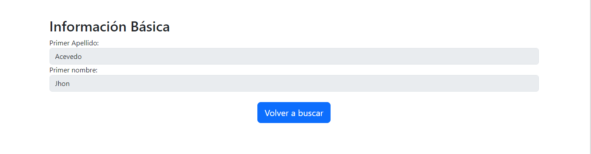

# Technical Test Banco Bogota

## Backend Spring boot

### Backend contains the code for creating

| API Endpoint                                                 | Method | Description                                      |
|--------------------------------------------------------------|--------|--------------------------------------------------|
| `/health`                                                    | GET    | Check state backend                              | 
| `/users/?{typeDocument}={value}&{documentNumber}={21321313}` | GET    | Return user by type document and document number |

### How to run the backend

1. Open the terminal and go to the backend folder
```bash
cd backend-periferia
```
2. Install dependencies with maven POM
3. Open the browser and go to `http://localhost:8080/health` to check the state of the backend
4. Open the browser and go to `http://localhost:8080/users/?typeDocument=CC&documentNumber=123456789` to get the user by type document and document number

## Frontend Angular

### Routes of the frontend

| Page            | Description                                      |
|-----------------|--------------------------------------------------|
| `/home`         | Home page with a form to search for a user       |
| `/user-details` | Page with the user information                   |

### How to run the frontend

1. Open the terminal and go to the frontend folder
```bash
cd frontend-periferia
```
2. Install dependencies with npm 
```bash
npm install
```
4. Run the project
```bash
ng serve
```

### Mockups of the frontend

1. Home page

2. User details page

